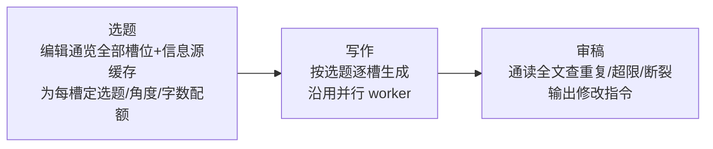

# Briefy 刊物质量路线图

> 版本：v3（正式） | 更新日期：2026-08-28
> 主题：**如何让产出的刊物质量更高**。分享传播、打包分发等话题不在此列。
> 基线：v0.13.6（单次创作链路完整，端到端验证通过）。
> 本版变更：融入评审意见——补 Q2 降级路径/进度展示/快照回退、配图首选 Tavily 图搜、源抓取缓存前置、多栏正文流提前、token 度量、实施顺序定稿。

## 0. 什么叫"刊物质量好"

四个字：**准、联、富、美**。

| 维度 | 含义 | 现状差距 |
| --- | --- | --- |
| 准 | 事实可信：数字、日期、新闻真实，来源可查 | AI 可能编造；抓取内容无来源署名；时效性内容不强制走工具 |
| 联 | 整份报是一篇连贯的编辑作品：槽位不重复、头条与正文承接、风格统一 | **逐槽独立生成、互不知情**——两栏可能写同一条新闻，头条与正文脱节 |
| 富 | 图文并茂：有配图、有图表、控件用得恰当 | 配图控件要求 AI 给 URL，实际几乎给不出有效图；图表仅表格一种 |
| 美 | 版面有报纸味：多栏正文流、层次节奏、排印细节 | 正文单栏流；混排栏 L1 未做；无首字下沉/引副题等报纸细节 |

质量主瓶颈在**联**（生成架构）与**富**（表现力）；准是底线，美是收尾。

## 1. 阶段规划

> 原则：每阶段独立交付可见的质量提升；涉及生成管线架构、新依赖的方案，开工前按 AGENTS.md §1 向用户确认。

### Q1 准 · 事实与来源（底线工程）

- **来源署名上版**：搜索/抓取产出的内容在槽位尾部自动附"来源：xxx"小字（样式受版式参数与黑白优先约束）；
- **时效锚定**：日期/数据敏感角色（快讯、数据等）提示词强制要求工具调用；未走工具时，提示词禁止陈述"今天/最新"类事实（仅提示词层软约束，不做硬校验，避免误伤）；
- **抓取质量**：网页正文提取效果评估与优化，失败源在内容中标注原因；
- **源抓取共享缓存（前置小步）**：按 URL 当日缓存抓取结果，同源多槽只抓一次——既消除现有慢源重试问题，又为 Q2 选题环节"通览全部源"提供数据基础。

### Q2 联 · 编辑部流程（质量核心，生成管线架构调整）

把"逐槽独立生成"升级为**编辑部三段式**：



- **选题**：一次 AI 调用产出"选稿单"（每槽写什么、互相不重复、谁让位给头条），写入生成上下文。**前置依赖**：Q1 的源缓存（选题必须基于真实源内容，否则是盲选题）；选稿单格式从简（每槽：角度 + 字数配额 + 与谁错开），结构化输出用现有 zod 校验；
- **写作**：每槽提示词注入选稿单中自己的选题 + 邻槽选题摘要，并行生成照旧；
- **审稿**：全部完成后一次自检调用，输出修改指令（如"第 3 栏与第 5 栏重复，重写第 5 栏"）。第一版**只提示用户 + 一键应用**，不做静默自动改写；
- **降级路径（必须）**：选题/审稿任一环节调用失败时，自动回退旧流程（逐槽独立生成）——保证任何情况下都能出报；
- **进度分阶段展示（必须）**：状态栏/按钮呈现"选题中 → 写作中 x/y → 审稿中"，避免新架构的长耗时被误认为"卡住"；
- **快照回退（必须）**：生成开始前自动存当前版 .briefy 快照，应用审稿修改前可一键还原；
- **兼容**：单槽重生成 / 终止 / 重试语义不变（单槽重生成时注入当前选稿单）；
- **模型分工**（设置项）：主模型 + 审稿模型两个简单设置项，不做复杂分级。

代价与收益：每期约增加 2 次 AI 调用（token 用量由 Q5 度量）；换来的是"像一份报"而不是"一堆格子的拼盘"。这是质量提升最大的一步。

### Q3 富 · 图文并茂（表现力）

- **配图闭环**：AI 只负责"配图意图 + 图注"，系统负责找到真图。**首选方案：Tavily 图片搜索**（`include_images` 参数，复用现有 Tavily Key，零新依赖）；页面主图提取作兜底。配图控件从"AI 编 URL"变为真正可用；
- **数据图表**：新增 chart 控件——AI 输出结构化数据 + 图表类型，渲染端纯 SVG 绘制（柱/折/饼），零外部依赖；统计卡与数据槽位优先受益；
- **多栏正文流（从 Q4 提前）**：body 槽位内容容器加 CSS `column-count`（栏数可设为版式参数）——一行样式即得报纸正文形态，且与现有溢出测量回写机制天然兼容，性价比极高；
- **控件使用引导**：提示词按槽位角色推荐应使用的控件组合，提升 AI 选用率。

### Q4 美 · 排版升级（报纸质感）

- **混排栏 L1 转正**（P6 残留）：槽位可声明跨栏/半栏，支持 headline 跨双栏、sidebar 半栏等组合（动分页模型，放最后）；
- **报纸细节**：可选首字下沉、小节分隔符、栏间线、引题/副题结构（headline 支持 kicker + 主标 + 副题）。

### Q5 量 · 质量度量（贯穿性基建）

- **最小检查层（Q2 动手前先铺）**：e2e 完成后自动断言——空槽、字数超限、槽间内容相似度粗检（字面 3-gram 重合度即可）、来源缺失、图片/图表渲染失败；基于现有 CDP 探针与 `__briefyGetDoc`，小半天工作量；
- **Prompt 回归**：提示词与流程改动前后用同一测试文档跑 e2e 对比产物，避免"改一处坏一片"；
- **Token/时长度量**：e2e 报告记录每期 token 用量与总耗时（主进程 AI 响应含 usage 字段）——Q2 的成本变化必须可量化。

## 2. 实施顺序（定稿）

```
Q1（含源缓存）→ Q5 最小层 → Q2（开关模式 + 降级 + 进度展示 + 快照）→ Q3（配图走 Tavily 图搜，多栏正文流并入）→ Q4
```

Q5 最小检查层必须先于 Q2——改生成架构必须有对照手段。多栏正文流从 Q4 提前至 Q3（性价比高、与图表同批交付"富"）。

## 3. 明确不做

- 富文本正文手动编辑（PRD 既定边界）；
- 分享/传播类功能（另行规划）；
- 打包、自动更新等工程杂务；
- 审稿静默自动改写（第一版只提示 + 一键应用；自动改写待快照体系验证后再议）。

## 4. 决策点（到点再问，先记录）

| 决策点 | 所属阶段 | 选项 / 风险 |
| --- | --- | --- |
| 编辑部三段式落地方式 | Q2 | 生成模式开关（默认旧流程，倾向此选）/ 全量切换；token 成本上升由 Q5 度量 |
| 配图方案 | Q3 | Tavily 图搜（首选，零新依赖）/ 页面主图提取（兜底）/ 两者 |
| 图表渲染 | Q3 | 自绘 SVG（零依赖，倾向此选）/ 引图表库（新依赖需确认） |
| 审稿自动修复权限 | Q2 | 只提示 + 一键应用（第一版，倾向此选）/ 自动重写一轮（需快照体系成熟） |
| 选题/审稿模型 | Q2 | 与主模型相同 / 独立设置项（建议后者，两个输入框即可） |
